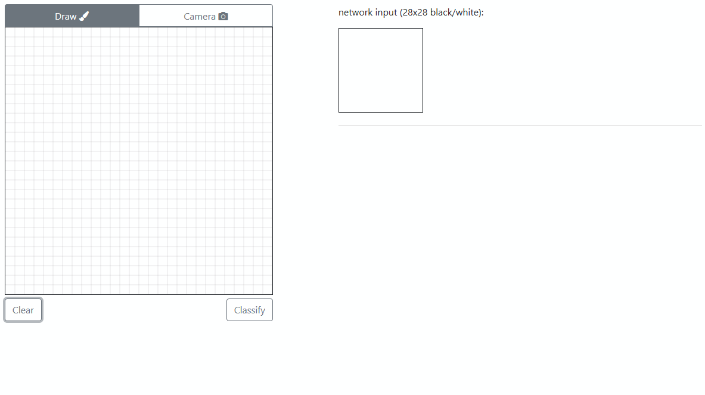

# Smiley Recognition using TensorFlow #

###### A Python app for smiley recognition, in which the training and the classification can be done on the interface using images generated with the mouse, imported from files, or even acquired from a webcam.



Parts of the code are based on [this repo](https://github.com/sugyan/tensorflow-mnist).

## General knowledge ##
We provide an easily understandable and concise backend and frontend capable of generating and importing data (i.e. images), as well as training and testing Machine Learning models for smiley recognition.

### Requirements ###
- We recommend to install [`miniconda`](https://conda.io/miniconda.html)

- Python >=3.5 (recommended 3.6.6)
  - TensorFlow >=1.9 (recommended 1.9.0)

### Installation ###
Start the anaconda prompt and simply follow these instructions:

```bash
> # Create and activate the environment
> conda create --name smiley python=3.6.6
> activate smiley
>
> # Set working directory to project directory
> cd <path_to_project>
>
> # Install the required packages
> pip install -r requirements.txt
> 
> # Run the app
> python main.py
> 
> # Navigate to localhost:5000 (opens automatically in your webbrowser)
```

The logs from training can be accessed on the Tensorboard webapp by running the following command and navigating to the indicated site:

    > python -m tensorboard.main --logdir smiley/data/logs
    

### Implementation details ###

##### Softmax Regression #####
This method uses a single weight matrix which is multiplied with the input. After that, a bias is added and softmax is applied to obtain class probabilities.

##### Convolutional Neural Network #####
It consists of two convolutional + max-pool layers followed by two fully connected layers with dropout on the first one. Softmax is also applied in the end to obtain class probabilities.

### Parameters ###
Changing important parameters, e.g. learning rates and number of epochs, can be done on the webapp. Further parameters can be changed in `smiley/config.ini`.
Description of all parameters of `smiley/config.ini`:

##### DEFAULT #####
- **max_number_user_categories:** number of maximum categories a user can add to the application
- **number_augmentations_per_image:** number of artificially created images per one original image (the artificial images are obtained by zooming-in/out, translating and rotating the original image)
- **max_angle_for_augmentation:** images are rotated maximum +/- this angle at augmentation
- **train_batch_size:** number of samples in a single batch
- **train_ratio:** the ratio of how much data will be used for training and how much for validation
- **image_size:** the width and height of the network-input images
- **predefined_categories:** the categories which are always available for the user

##### CNN #####
+ **learning_rate:** hyper-parameter that controls how much the weights of our network are adjusted for an optimizer step
+ **epochs:** number of times the entire (train-)dataset is passed forward and backward through the network
+ **model_filename:** the filename of the stored CNN model

##### REGRESSION #####
+ **learning_rate:** controls how much the weights of our network are adjusted with respect for an optimizer step
+ **epochs:** number of times the entire (train-)dataset is passed forward and backward through the network
+ **model_filename:** the filename of the stored softmax regression model

##### LOGS #####
+ **train_accuracy_display_step:** determines how often the accuracy of the current model on the train samples is displayed on the console
+ **validation_step:** determines how often the accuracy of the current model on the validation set is computed and displayed on the console
+ **expand_display_step:** determines how often the progress at the data augmentation is logged on the console

##### DIRECTORIES #####
+ **logic:** contains the important scripts, image data and stored models of the program
+ **categories:** contains the image data
+ **models:** contains the stored models of the program
+ **logs:** contains the tensorflow log files for the Tensorboard

### License ###
[MIT License](LICENSE)
